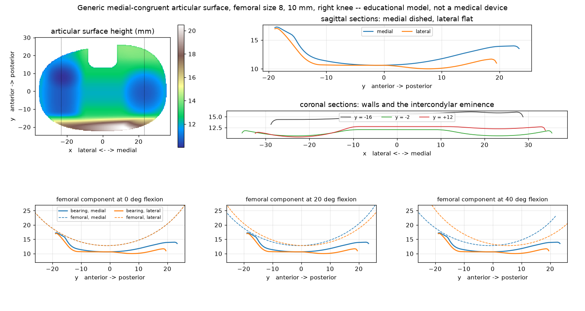

# Models

Generated 3D reference geometry for OrthoID. Every model here is a **generic
teaching/research shape, not a medical device**, and none is a reproduction of
any manufacturer's product. Do not use them for clinical planning, implant
sizing, templating, or fabrication of anything placed in a patient.

Meshes are binary STL in millimetres, watertight and manifold. They are built
from signed distance fields by the scripts in [`../tools`](../tools) rather
than committed as opaque blobs — edit the parameters at the top of a generator
to change the geometry.

```bash
pip install numpy scipy scikit-image matplotlib
python3 tools/generate_femoral_component_stl.py --size 10
python3 tools/generate_femoral_component_stl.py --size 8 -o models/generic-tka-femoral-size8.stl
python3 tools/generate_femoral_component_stl.py --size 7 -o models/generic-tka-femoral-size7.stl
python3 tools/generate_implant_stl.py
python3 tools/generate_articular_surface_stl.py --thickness 10 --side right
python3 tools/preview_articular_surface.py
```

Each generator prints triangle count, achieved dimensions, wall thickness and a
watertightness check, so a regenerated mesh can be sanity-checked before use.

## `generic-tka-femoral-size{7,8,10}.stl`

A generic cruciate-retaining total-knee femoral component, committed at three
sizes (each mesh is ~30–35 MB, so not every size 3–12 the generator supports
is committed; pass `--size` and `-o` to produce another one).

**Envelope scaled to the published Persona CR femoral (standard) size table.**
That table is the only geometry the manufacturer publishes, and it is what the
model reproduces:

| From the published table | Size 7 | Size 7 model | Size 8 | Size 8 model | Size 10 | Size 10 model |
| --- | --- | --- | --- | --- | --- | --- |
| Overall A/P | 62.1 mm | 62.07 mm | 63.8 mm | 63.77 mm | 68.5 mm | 68.46 mm |
| Functional A/P | 53.0 mm | 53.00 mm | 55.0 mm | 55.00 mm | 59.0 mm | 59.00 mm |
| Overall M/L | 69.5 mm | 69.50 mm | 71.3 mm | 71.30 mm | 74.8 mm | 74.80 mm |
| Distal thickness | 9 mm | 9.00 mm | 9 mm | 9.00 mm | 9 mm | 9.00 mm |
| Condyle thickness | 9 mm | 9.00 mm | 9 mm | 9.00 mm | 9 mm | 9.00 mm |

Everything else is a **design assumption**, invented from generic total-knee
conventions because it is not published:

| Design assumption | Size 7 value | Size 8 value | Size 10 value |
| --- | --- | --- | --- |
| Medial condyle: sagittal = coronal radius (spherical) | 32.0 mm | 32.9 mm | 35.3 mm |
| Lateral condyle coronal radius | 30 mm | 30 mm | 30 mm |
| Anterior flange height | 47.7 mm | 49.5 mm | 53.1 mm |
| Posterior condyle height | 25.4 mm | 26.4 mm | 28.3 mm |
| Anterior & posterior chamfer length | 11.4 mm | 12.0 mm | 13.0 mm |
| Intercondylar notch width | 20.9 mm | 21.4 mm | 22.4 mm |
| Trochlear groove depth | 2.6 mm | 2.6 mm | 2.6 mm |
| Fixation pegs | 2 × ⌀6 mm, 11 mm long | 2 × ⌀6 mm, 11 mm long | 2 × ⌀6 mm, 11 mm long |
| Wall thickness (range) | 6.2 – 10.3 mm | 6.0 – 10.4 mm | 5.9 – 10.3 mm |

The anterior flange height was lengthened from an initial 0.60 fraction of
functional A/P (35.4 mm at size 10) to 0.90 so the flange sweeps past the
resection box before it's cut off (matching how the anterior shield reads on
real CR femoral components), rather than terminating flush with the box. The
extension is tangent-continuous with the articular J-curve, not a separate
flat panel. The flange's proximal tip is domed rather than cut flat: it dips
7 mm towards the M/L edges instead of ending in a straight line across the
width.

Construction: the bone-facing surface is the exact five-cut resection box
(anterior, anterior chamfer, distal, posterior chamfer, posterior). The
articular surface is a multi-radius J-curve, integrated from a prescribed
radius-vs-tangent-angle profile and scaled so the envelope lands on the table.

The condyles are **asymmetric**, so the component is side-specific: +x is the
medial side and `--side` mirrors it. That asymmetry is the design, not a
detail. The medial condyle is **spherical** -- its coronal radius is set equal
to its own sagittal radius, and its sagittal radius is held constant across the
functional arc. Only a sphere is invariant under both flexion about a medial
pivot and axial rotation about a vertical axis through it, so only a sphere
lets a mating medial-congruent bearing keep a congruent socket. The lateral
condyle is the larger of the two and keeps a multi-radius profile closing down
posteriorly, so it can roll back along an arcuate path. The trochlea is set
back proximally over the region that would otherwise sweep across the anterior
tibial plateau, which is what leaves a bearing room for its anterior lip.

Measured on the size-8 field: medial condyle 32.88 mm sagittal by 33.15 mm
coronal (spherical to within 1%), lateral condyle 30.05 mm coronal. A fixed
medial pivot now tracks the component to **95 degrees** of flexion before it
lifts 1 mm, against 39 degrees for the earlier multi-radius design.

**Known limitations.** There are no
fixation-surface features (porous coating, cement pockets) and no box or cam.
The articular surface is plausible, not validated — it is not suitable for
contact-mechanics or wear work without independent verification.

**Printing.** Size 7: 659,426 triangles, 51.4 cm³. Size 8: 701,218 triangles,
53.4 cm³. Size 10: 736,218 triangles, 61.9 cm³. All oriented
distal-surface-down with the open (bone-facing) side up; all will need
supports under the anterior flange and the posterior condyles.

## `generic-tka-articular-surface-mc-size8-10mm-right.stl`

A generic **medial-congruent tibial articular surface** (the tibial insert /
bearing) for the size-8 femoral component above. Committed at 10 mm thickness
for a right knee; pass `--thickness` and `--side` for others (each mesh is
~15 MB, so only one is committed).

### It is designed against the femoral, and verified against it

The femoral component's geometry reaches this generator by import, not by
transcription: [`../tools/femoral_geometry.py`](../tools/femoral_geometry.py)
is a thin layer over `generate_femoral_component_stl.py` that adds the
articular envelope as a poseable signed-distance field. Edit the femoral
generator's parameters and the bearing follows.

The surface is *designed* and then *verified*, not carved. An earlier version
was carved -- the femoral envelope swept and subtracted from a blank, capped by
a wall height -- and that is a boolean of two subtractions, which meet each
other in creases. It produced a flat-topped post moulded to the intercondylar
notch, square shoulders, a raised shelf running fore and aft, and a trench
below the nominal floor. Fixing those one at a time only ever moved a seam.

What is here instead is one smooth height field: two toroidal compartments,
their radii taken from the femoral's own distal sagittal and condylar coronal
radii, joined by a smooth minimum that forms the saddle and lifted into the
anterior lip by a smooth maximum. Every operator is smooth, so the surface has
no creases anywhere.

Non-interference is structural rather than tuned. The designed surface is held
under the swept femoral envelope by a smooth minimum, so it can never sit above
the lowest the component can reach however the parameters are set, and the
generator asserts up front that no dish radius is tighter than the condyle it
must seat. The compartments still differ in the way that makes the bearing
medial congruent: the medial one is a socket at the femoral's own sagittal
radius, the lateral one is flat along the floor for 12 mm before its arc
starts, so the lateral condyle can roll back over it.

### Measured on the committed mesh

Several dimensions that used to be design assumptions now come from the Persona
Medial Congruent Bearing Design Rationale. A size-8 CR femur takes the 8-11/EF
bearing, so the plateau is the size E baseplate and the lip heights are that
row.

| From the published rationale | Published | Model |
| --- | --- | --- |
| Overall M/L (size E baseplate) | 71.0 mm | 71.00 mm |
| Medial A/P | 50.2 mm | 50.2 mm |
| Lateral A/P | 44.6 mm | 44.6 mm |
| Posterior medial lip height | 3.4 mm | 3.4 mm |
| Lateral condyle axial path | 14 deg | 14 deg |
| Lateral A/P laxity, 0-120 deg | 11 mm | 10.5 mm |
| Medial A/P laxity, 0-120 deg | 3 mm | 5.2 mm |
| Anterior medial lip height | 11 mm | 9.86 mm |

The plateau is asymmetric: its medial half is deeper front-to-back than its
lateral half, which is most of what makes a tibial component read as a kidney
rather than an oval.

| Geometry taken from the size-8 femoral | Femoral | Designed | Achieved |
| --- | --- | --- | --- |
| Medial sagittal radius | 32.88 mm | 33.28 mm | socket |
| Medial coronal radius | 33.15 mm | 33.75 mm | socket |
| Lateral coronal radius | 30.05 mm | 30.65 mm | relieved |
| Condyle centre lines | +/-23.17 mm | +/-23.17 mm | -- |

A fitted radius is a poor description of a compartment with a deliberate flat
run in it, so the honest contrast between the two is in plain distances: the
A/P run over which each stays within 0.25 mm of its own floor is **10.8 mm
medial against 26.0 mm lateral**, and 10 mm behind the floor the medial surface
has climbed 0.92 mm while the lateral has not climbed at all.

| Design assumption | Value |
| --- | --- |
| Polyethylene thickness at the medial socket floor | 10.0 mm |
| Bearing clearance (also the print fit at the socket) | 0.4 mm |
| Posterior cruciate cut-out | 16 mm wide x 9 mm deep; the rationale does not dimension it |
| Lateral flat run before the arc starts | 12 mm |
| Volume | 33.89 cm3 |

**Minimum gap to the femoral component across the flexion sweep: +0.39 mm**, the
mesh is watertight, and the bearing is exactly 10.00 mm thick at its thinnest
point anywhere. All three are checked on every build.

There is a posterior cruciate cut-out and no intercondylar eminence: the central
corridor between the compartments is held at the articular floor, so nothing
stands proud where the lateral condyle has to roll back, and the A/P and
rotational restraint comes from the medial socket rather than from a spine.

**Known limitations.** The anterior lip reaches 9.86 mm against the 11 mm
published; the clearance clamp still trims the last millimetre, because this
generic trochlea is a set-back region on a J-curve rather than a real
patellofemoral groove. Medial A/P laxity comes out at 5.2 mm against the 3 mm
the rationale reports, so the pivot is looser than the real bearing's -- the
medial condyle is spherical over the functional arc but not beyond it, and the
contact drifts once flexion carries it past that arc. Past 95 degrees the
component lifts off a fixed pivot, so deep-flexion contact is still not
modelled, only guaranteed not to interfere.

Beyond those: there is no locking mechanism, the inferior surface being flat
with a chamfered edge, so this models the bearing surface only and not a tray
interface. The rationale's 155 degrees of flexion is well beyond what this
static model resolves. As with the femoral, the articular surface is plausible,
not validated.

**Printing.** Flat-bottomed, so it prints straight onto the bed in the
orientation it is generated in, articular side up, with no supports. At 10 mm
thick nothing overhangs beyond the 0.8 mm base chamfer. If you print the
size-8 femoral too and want them to articulate, print the bearing first and
check the fit: the 0.4 mm modelled clearance is a bearing gap, not a print
allowance, and most FDM processes will eat it. Raise `--clearance` to
0.6-0.8 mm for a pair that actually moves.



## `generic-bone-plate.stl`

A generic contoured bone plate with six countersunk screw holes. Entirely
invented dimensions — no manufacturer data is involved.

| | |
| --- | --- |
| Overall length × width × thickness | 96 × 12 × 3.6 mm |
| Sagittal contour radius | 250 mm (concave undersurface) |
| Screw holes | 6 × ⌀3.5 mm, 15 mm pitch, 90° countersink |
| Volume | 3726 mm³ (≈16.5 g in Ti-6Al-4V) |
| Mesh | 303,352 triangles |
